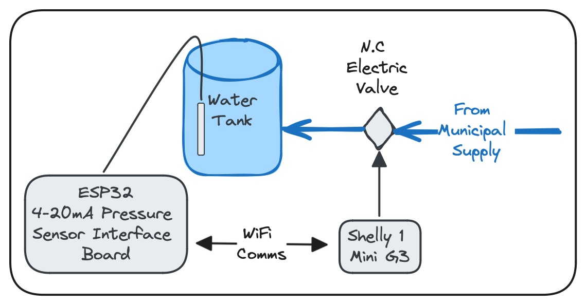
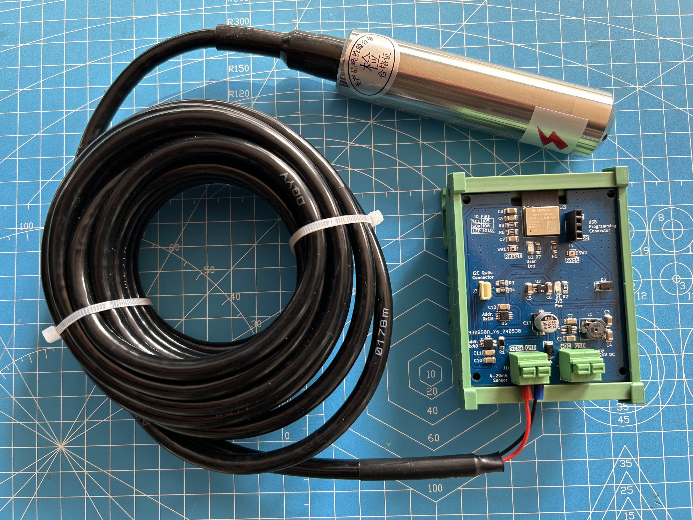

# Shelly-Water-Level-Sensor-Integration

Shelly Gen3 device integration with custom water level sensor board running ESPHome

## Description

My friend's home municipal water supply gets interrupted on a constant basis, meaning that his family can be without water for a few days. My friend opted to install water tanks that store water before it enters the home. In this way the family will have water during the period when the supply is cut off.

Two problems currently exist:

- Sometimes the mechanical ball valve on the inlet to the storage tank gets stuck in the open position, and then the tank overflows, leading to a hefty bill for water.
- At times the water supply is cut off for so long that the stored water runs out.

The proposed solution:

- Install a normally closed (NC) electrically controlled motorised ball valve at the inlet to the tank, and only let in enough water to fill the tank.
- Install a water pressure sensor that can detect various water levels and send the data to a controller that will notify the family of water level issues.

Options explored:

- The NC electrically controlled ball valve can be closed with an electrical circuit connected to a better quality float switch (small ball rising in a tube).
- Make use of my own solution that consists of stable and accurate ESP32 sensor module that connects to a 4-20mA pressure sensor. This sensor connects to Home Assistant that send out the notifications and does the control
- Add the 4-20mA pressure sensor to a Shelly device and write scipts to do the sensor interface and control.

Deciding on a solution:

- My friend loves what Home Assitant can do, but he does not want to invest in such an eco system, as it looks far too complicated to him.
- Interfacing the 4-20mA sensor to the Shelly requires a current to voltage converter or sourcing a DC version of this sensor. The scripting also looked like it will be time consuming to write and debug. (something to be explored later)
- I therefore proposed that I expose the web interface of the ESP32 water sensor and allow for the tank parameters to be added, and in so doing calculate the volume of water etc. This was a very easy change as the device runs on ESPHome.
- A Shelly device is then used as a replacement for Home Assitant to read the ESPHome ESP32 sensor, control the inlet valve and send out notifications when the water level reaches some preset threshold.

What follows is the Shelly 1 Mini Gen3 javascipt code that implement the water tank IoT controller.

---

## System diagram:

Water from the municipal connection fills the tank via a 24V DC electric normally closed inlet valve. A Shelly 1 Mini G3 provides power to the inlet valve in order to open the inlet and allow water to flow in to the tank. The Shelly device also shuts off power to the inlet valve based on preset criteria.

<!--  -->

The water level in the tank is measured by a pressure sensor connected to an ESP32C3 interface board that is on the same wifi network as the Shelly device. The Shelly device polls the interface board for the water level as a % of the tank volume.

---

## Pressure sensor and interface board

### Pressure sensor

The industrial stainless steel submersible pressure level sensor adopts a high-performance pressure sensing chip, with advanced circuit processing and temperature compensation technology. The submersible pressure level sensor receives different pressures at different depths of liquid, which can be converted into corresponding current signals and output through the sensor. In this way, the depth of liquid can be measured.

### Interface board

---

## Shelly device
